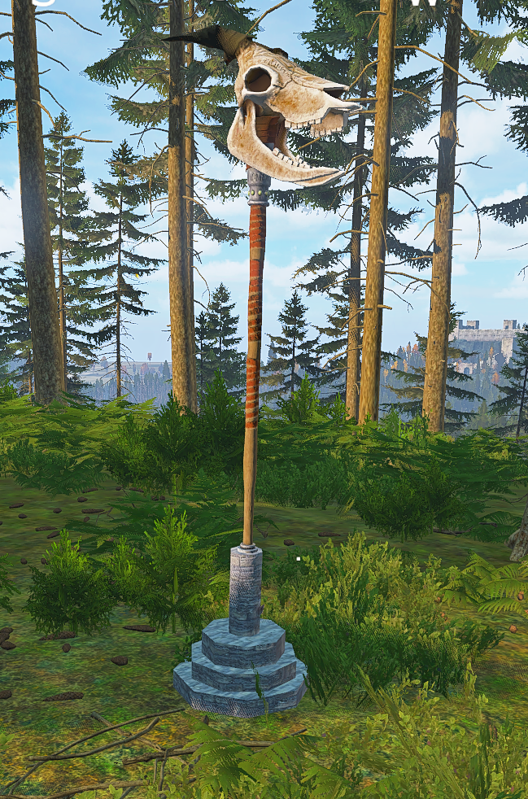

# fx-skull-staff-holder

A stone stand for Deer Isle's skull staff (`SRP_Staff_Skull_Basic`).

Deer Isle resized the staff to `itemSize[] = {11,11}` and added checks that stop you storing
clothing it's attached to. That's fine for vanilla. On a basebuilding server it means the
staff can't go anywhere except your hands.

## Repacking is fine

Repack it, rename it, throw it in your server pack. You don't need to credit me or ask. I'd
rather it got used than have people skip it because it's one more mod in the launcher.

## What it does

Craft a Staff Holder from a hammer and a stone. It's heavy, so you carry it in your hands and
put it down instead of stowing it. Attach the staff and it renders on the stand. You can't
pick the stand back up until you take the staff off.

It goes around Deer Isle's checks instead of patching them, so an update to the map can't
break it:

- their `CanPutAsAttachment` only refuses when the parent is already in cargo, so the staff
  goes on while the stand is in your hands or on the ground
- their `CanPutInCargo` override is on `Clothing`, and the stand isn't clothing

None of the Deer Isle files are touched.

## Requires

`Survivalists_Weapons_JMC_Proxy`. It ships with Deer Isle and declares the melee slot the
staff attaches through. Nothing else.

## Building

The addon is just `mod/FX_SkullStaffHolder`, so any packer will do. `dayz.yml` is the manifest
for my [own tooling](https://github.com/Jyrno42/fx-dayz-tools).

Watch out if you move or rename the repo: the PBO prefix is baked into `config.cpp` and into
the models. You'd need to update `dayz.yml` and the paths in `config.cpp`, and the proxy
reference inside `staffholder.p3d` points at `staffskullprox.p3d` by full prefix, so that one
needs editing in Object Builder.

## The model

Octagonal stone tiers under a column, one convex component per tier for collision. The stone
is a vanilla texture (`bricks_rocks_castle_01`) darkened in the rvmat, so no textures ship
with this.

`staffskullprox.p3d` is the attachment proxy. A model can't reference an attachment's p3d
directly, so it points at this instead, and the `ProxyAttachment` entry in `config.cpp` binds
it to the slot.

## Licence

WTFPL. See [LICENSE.md](LICENSE.md).
